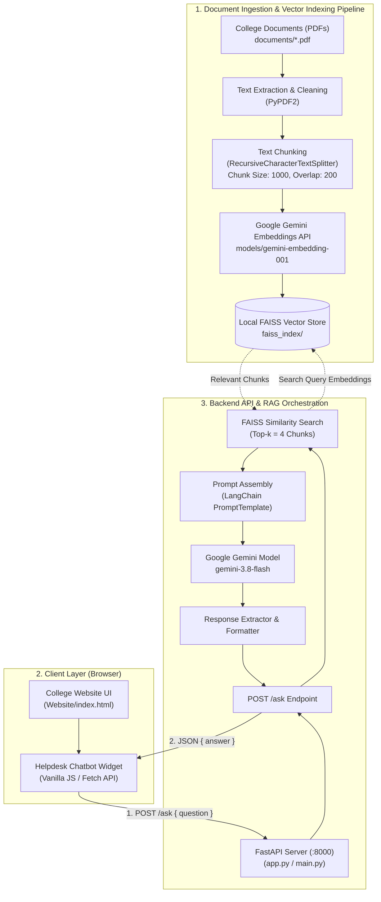

# System Architecture - Info Bot (RAG Based AI Assistant)

This document details the architectural design, data pipelines, and runtime workflows for the **Info Bot** application.

---

## Architecture Diagram



---

## Detailed Data Flow

### 1. Ingestion & Indexing Pipeline (One-Time / Cached)
1. **Document Loading**: Raw college documents (e.g. notices, rulebooks, curriculums) in PDF format are stored in `Backend Chatbot Python/documents/`.
2. **Text Normalization**: `PyPDF2` extracts raw text and strips solitary newlines produced by PDF span breaks to form clean sentences and paragraphs.
3. **Chunking**: `RecursiveCharacterTextSplitter` segments the text into chunks of 1,000 characters with a 200-character overlap to retain context across boundaries.
4. **Embedding Generation**: Chunks are processed via the Google GenAI embedding model (`models/gemini-embedding-001`), producing 3072-dimensional vector representations.
5. **FAISS Local Cache**: The vector index is persisted to disk under `Backend Chatbot Python/faiss_index/` so subsequent server restarts load in under 2 seconds without consuming embedding API quota.

---

### 2. Runtime Retrieval-Augmented Generation (RAG) Flow
1. **User Query**: The student or visitor types a question in the floating chatbot widget on the website (`Website/index.html`).
2. **API Request**: The client dispatches a `POST` request to `http://127.0.0.1:8000/ask` with JSON `{ "question": "..." }`.
3. **Similarity Retrieval**: FastAPI queries the loaded FAISS vector store using cosine / L2 distance to retrieve the top 4 most relevant text passages.
4. **Context Injection**: The retrieved passages are merged into the system prompt template:
   ```
   You are a helpful college assistant who answers questions based on the snippets of text provided in context.
   Answer only using the context provided, being as accurate, clear, and helpful as possible.
   If the information is not available in the context, respond with:
   "The answer is not available in the context provided."
   ```
5. **Inference**: The combined prompt and context are sent to Google Gemini (`gemini-3.8-flash`).
6. **Delivery**: The structured response is parsed, returned as JSON `{"answer": "..."}`, and formatted in the chat interface.

---

## Component Reference

| Component | Technology | Path / Reference |
| :--- | :--- | :--- |
| **Frontend UI** | HTML5, CSS3, Vanilla JS | `Website/index.html` |
| **API Server** | FastAPI, Uvicorn | `Backend Chatbot Python/app.py`, `Backend Chatbot Python/main.py` |
| **Vector DB** | FAISS CPU (`faiss-cpu`) | `Backend Chatbot Python/faiss_index/` |
| **Embedding Model** | Google Gemini `gemini-embedding-001` | Cloud API |
| **LLM Model** | Google Gemini `gemini-3.8-flash` | Cloud API |
| **PDF Documents** | College knowledge base | `Backend Chatbot Python/documents/` |
